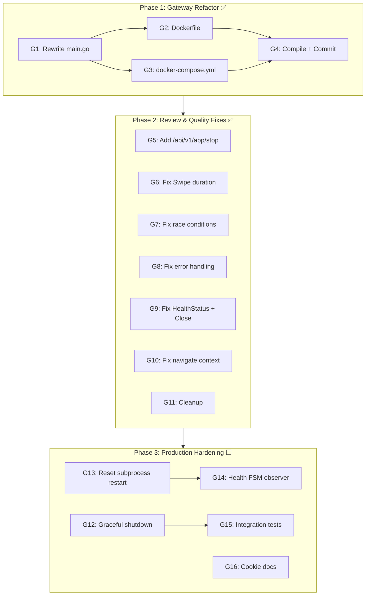

# Task Dependency Graph — src-web-gateway

```mermaid
graph TD
    subgraph Phase1 [Phase 1: Gateway Refactor ✅]
        G1[G1: Rewrite main.go]
        G2[G2: Dockerfile]
        G3[G3: docker-compose.yml]
        G4[G4: Compile + Commit]
        G1 --> G2
        G1 --> G3
        G2 --> G4
        G3 --> G4
    end

    subgraph Phase2 [Phase 2: Review & Quality Fixes ✅]
        G5[G5: Add /api/v1/app/stop]
        G6[G6: Fix Swipe duration]
        G7[G7: Fix race conditions]
        G8[G8: Fix error handling]
        G9[G9: Fix HealthStatus + Close]
        G10[G10: Fix navigate context]
        G11[G11: Cleanup]
    end

    subgraph Phase3 [Phase 3: Production Hardening ⬜]
        G12[G12: Graceful shutdown]
        G13[G13: Reset subprocess restart]
        G14[G14: Health FSM observer]
        G15[G15: Integration tests]
        G16[G16: Cookie docs]
        G13 --> G14
        G12 --> G15
    end

    Phase1 --> Phase2
    Phase2 --> Phase3
```
